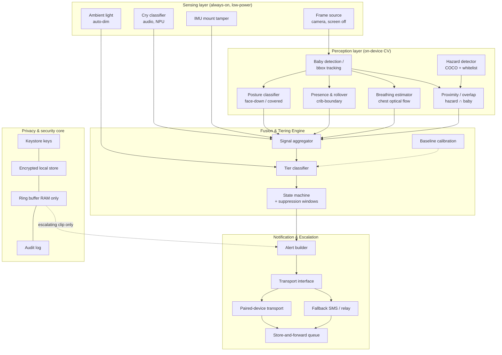
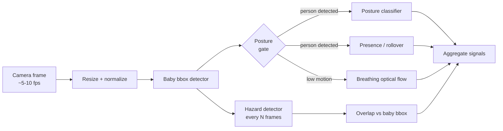
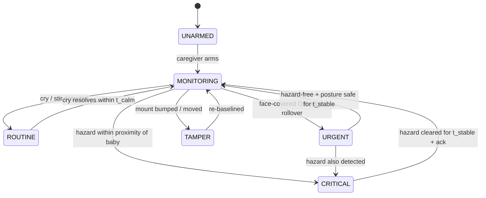

# NightWatch — System Architecture

Revised end-to-end design after gap analysis. Traces the system from a camera/audio
signal to a tiered alert, defines the data model, and records the failure modes that
shaped the design.

- Audience: engineers implementing or reviewing the system.
- Companion docs: [`IMPLEMENTATION_GUIDE.md`](IMPLEMENTATION_GUIDE.md),
  [`BUILDERS_GUIDE.md`](BUILDERS_GUIDE.md).

---

## 1. Problem statement

Parents and caregivers use baby monitors that stop at cry and motion detection. Once a
child becomes mobile, the risk profile changes: the same room that was safe for a
sleeping infant now contains cables, bags, small objects, and outlets. Cloud-based
monitors are too slow and too privacy-invasive for near-instant, always-on hazard
flagging, and they leave the phone screen on or the feed streaming remotely.

**Design goal:** a single mounted phone that monitors sleep quality and posture, and
extends into active hazard awareness once the baby is mobile — all on-device, with
alerts tiered by severity.

**Success criteria**

| Criterion | Target |
|---|---|
| Cry classification | category + confidence, on-device, < 1 s |
| Posture flag (face covered) latency | < 3 s |
| Hazard proximity flag latency | < 1 s (near-instant, no network) |
| Breathing estimate | approximate rate, confidence-gated |
| Alert tiers | 0 routine / 1 urgent / 2 critical, independently routed |
| Privacy | no frames or audio stored or transmitted unless an alert fires |
| Dark operation | screen off/dimmed, no visible light emitted |

**Out of scope (boundaries)**

- Not a medical device; does not diagnose, treat, or prevent SIDS.
- Not a replacement for direct supervision or safe-sleep practices.
- No cloud video streaming or remote live-view in the default build.
- No fine-grained hand-object grasping detection (see gap 6).
- Not a general home-security camera.

---

## 2. Layered architecture



### Why these components are separated

- **Sensing layer** — the camera, mic, IMU, and light sensor have different sampling
  rates and power costs. Separation lets sensing be throttled or degraded independently
  (e.g. drop camera at night when there is no IR and keep audio + IMU).
- **Perception layer** — baby detection is shared by four consumers (posture, presence,
  breathing, hazard). Computing one baby bbox and reusing it is both cheaper and more
  consistent than four independent detectors.
- **Fusion & Tiering Engine** — tiering and suppression live in one place so alert policy
  can be reasoned about and tested without touching CV code.
- **Notification & Escalation** — the only code that reaches the network; keeps the
  on-device guarantee auditable and transports swappable.
- **Privacy core** — one place to enforce "no persistence, no transmission" and to hold
  the ring buffer.

---

## 3. Frame pipeline

Camera frames are the expensive resource. The pipeline runs in stages and only pays for
downstream work when upstream stages warrant it.



**Cadence policy**

| Stage | Frequency | Rationale |
|---|---|---|
| Cry classification | continuous (audio) | cheap, always-on DSP/NPU |
| Baby bbox | ~5–10 fps | anchor for all CV consumers |
| Posture | every frame w/ baby | posture changes matter immediately |
| Presence/rollover | every frame | edge rollover is time-critical |
| Breathing | ~15–30 s windows | needs a stable window to estimate rate |
| Hazard detector | every N frames (e.g. 3) | object classes change slowly; save power |
| Proximity | on each hazard detection | trivial geometry |

---

## 4. State machine and tiering



**Tier policy**

| Tier | Signals | Routing | Suppression |
|---|---|---|---|
| 0 routine | cry/stir | silent buzz | debounce per cry episode |
| 1 urgent | posture (face-down/covered) or rollover to edge | urgent alert | only while condition persists |
| 2 critical | hazard bbox overlaps/near baby bbox | immediate high-priority alert | suppress re-alert while same object persists; re-alert on new object |

**Tier precedence:** critical > urgent > routine. A single event produces the highest
applicable tier; lower-tier signals during a critical event are recorded but not sent.

**Baseline calibration** (`C4`) records the empty-crib scene, crib boundary, lighting, and
nominal baby size, so presence/rollover and hazard proximity have a reference frame.

---

## 5. Data model

```kotlin
data class BabyState(
    val bbox: RectF,               // normalized 0..1 frame coords
    val posture: Posture,          // SUPINE, PRONE, SIDE, COVERED, UNKNOWN
    val inCrib: Boolean,
    val edgeRisk: Float,           // 0..1 proximity to calibrated crib boundary
    val breathingRate: Float?,     // breaths/min, null if not estimable
    val breathingConfidence: Float,
    val updatedAt: Long
)

data class CryEvent(
    val id: String,
    val category: CryCategory,     // HUNGRY, PAIN, DISCOMFORT, NORMAL
    val confidence: Float,
    val startedAt: Long
)

data class HazardDetection(
    val id: String,
    val label: String,             // whitelist class, e.g. "cable", "bag", "bottle"
    val bbox: RectF,
    val detectionConfidence: Float,
    val proximity: Float,          // 0..1, 1 = overlapping baby bbox
    val babyTouching: Boolean,     // proximity above contact threshold
    val frameTimestamp: Long
)

data class MountEvent(
    val timestamp: Long,
    val disturbance: Float,        // IMU anomaly magnitude
    val moved: Boolean             // baseline angle shifted beyond threshold
)

data class AlertEvent(
    val id: String,
    val tier: AlertTier,           // ROUTINE, URGENT, CRITICAL
    val reasons: Set<String>,      // e.g. {"posture:covered", "hazard:cable"}
    val payload: AlertPayload,
    val createdAt: Long
)

data class AlertPayload(
    val alertId: String,
    val tier: AlertTier,
    val sentAt: Long,
    val babyState: BabyState?,
    val hazard: HazardDetection?,
    val cryEvent: CryEvent?,
    val clipSnippet: ByteArray?,   // opt-in, present only for escalated events
    val signature: ByteArray
)
```

**Structural notes (painful to migrate later)**

- `BabyState.bbox` is normalized to frame coordinates so it is independent of resolution
  and camera model; calibrate once per mount position.
- `HazardDetection.label` is a stable string from a versioned whitelist; adding classes is
  additive, never renames existing labels.
- `AlertPayload` carries `schemaVersion` on first release — the receiver app updates
  independently.
- `clipSnippet` is opt-in and null by default.

---

## 6. Storage, power, and privacy

| Data | Where | Retention |
|---|---|---|
| Camera frames | RAM only | discarded each frame; never written |
| Audio ring buffer | RAM only | continuous, discarded |
| Event clip (opt-in) | RAM → encrypted file only if escalated | deleted after send + 24 h |
| BabyState / HazardDetection | RAM (current) + encrypted audit log | audit 7 days rolling |
| Trusted contact + keys | Encrypted local store | until removed |
| Baseline/calibration | Encrypted local store | until re-calibrated |

**Power and thermal**

Camera + continuous inference is the dominant cost. Mitigations:

- frame rate throttling by tier (higher fps only when a condition is active),
- hazard detection every N frames,
- breathing only in stable windows,
- degrade to audio + IMU when the device reports thermal throttling,
- `WAKE_LOCK` is bounded and released on disarm.

**Privacy**

- No frame or audio leaves the device unless an alert escalates and the user opted into
  clip evidence.
- No remote live-view in the default build.
- Camera pipeline has no disk writes; the OS camera/mic privacy indicators remain honest.

---

## 7. Gaps found and how the architecture addresses them

| # | Failure mode | Fix integrated into the design | Trade-off |
|---|---|---|---|
| 1 | Dark room; camera sees nothing | ambient light gates CV; require an IR/night-vision path or degrade to audio + IMU, as an explicit capability check | reduced CV coverage in unlit rooms without IR |
| 2 | Face-down vs. face-covered distinguishability; soft blankets are hard | posture classifier treats `COVERED` as an occlusion class rather than relying on COCO "blanket" | some false `COVERED` positives, mitigated by persistence + confidence gating |
| 3 | Breathing optical flow unreliable under swaddle/motion | breathing is confidence-gated and never alerts alone; always cross-checked with posture | breathing shown as approximate, not a hard alarm |
| 4 | Child video privacy | on-device only, RAM-only frames, no cloud, no live-view, opt-in clips | caregiver must be physically near or use tiered alerts, not remote video |
| 5 | Mount position changes over time | IMU tamper detection + baseline calibration; re-calibrate on shift | requires a re-calibration action after any mount move |
| 6 | "Hand near object" vs. "object visible" | scope conservatively to bbox proximity/overlap, not grasping | may flag a hazard in the crib that the baby is not truly reaching for |
| 7 | COCO class coverage for baby hazards (bags, bedding) is imperfect | versioned hazard whitelist over COCO classes + optional small custom classes | whitelist maintenance as models evolve |
| 8 | Multiple people/animals in frame | baby bbox anchored by calibration + size/position heuristics | ambiguous in busy rooms; confidence drops |
| 9 | Overheating / battery drain from continuous CV | tiered frame rates, hazard every N frames, thermal-aware degradation | coarser detection under thermal load |
| 10 | Edge-rollover detection depends on crib geometry | crib boundary captured at calibration; `edgeRisk` is relative to it | re-calibrate after rearranging the room |
| 11 | Alert fatigue | tiering + suppression windows per tier and per object | a persistent hazard does not re-alert until cleared |
| 12 | Tier 2 must be near-instant | fully on-device, no cloud round-trip in the critical path | no off-device processing fallback |
| 13 | Baby fully occluded (buried under blanket) | presence/posture marked `UNKNOWN`, escalate to caregiver rather than silently pass | more "check on baby" prompts |
| 14 | Night motion blur / low light | lower fps + exposure tuning; confidence gating; degrade gracefully | less precision at night |

---

## 8. Integration points and fallbacks

| Dependency | Role | If unavailable |
|---|---|---|
| Camera | all CV signals | audio + IMU only; log degraded mode |
| NPU/DSP delegate | fast inference | CPU fallback at reduced fps; flag thermal risk |
| Paired-device transport | primary alert delivery | fall through to SMS/relay, enqueue |
| Location (optional) | context only, not core to crib monitoring | omit; crib monitoring is location-independent |
| Push service | receiver wake-up | receiver polls relay on next foreground |

> **Open item — paired-device transport.** The transport/SDK is not yet defined. Model it
> as a `Transport` interface (`send(payload): Result` + `isReachable(): Boolean`) with a
> pluggable implementation. No other component depends on its internals. See
> [`IMPLEMENTATION_GUIDE.md`](IMPLEMENTATION_GUIDE.md) Phase 5.

---

## 9. Boundaries recap

- No cloud video, no remote live-view by default.
- Frames are never written to disk outside an opted-in escalated clip.
- Hazard detection is proximity-based, explicitly not grasping detection.
- NightWatch does not prevent SIDS and is not a medical device.

---

## 10. Delivery guarantee model

Escalation is **at-least-once**:

1. Build `AlertPayload`, sign it with the device key.
2. Try primary transport; on success, mark delivered.
3. On failure, enqueue (encrypted) with backoff.
4. Retry on network/pairing regain; a delivery receipt clears the entry.
5. Receiver de-duplicates by `alertId`.

Tier 2 never waits on a network round-trip: detection, tiering, and dispatch initiation
are all local. Transport success is tracked asynchronously.